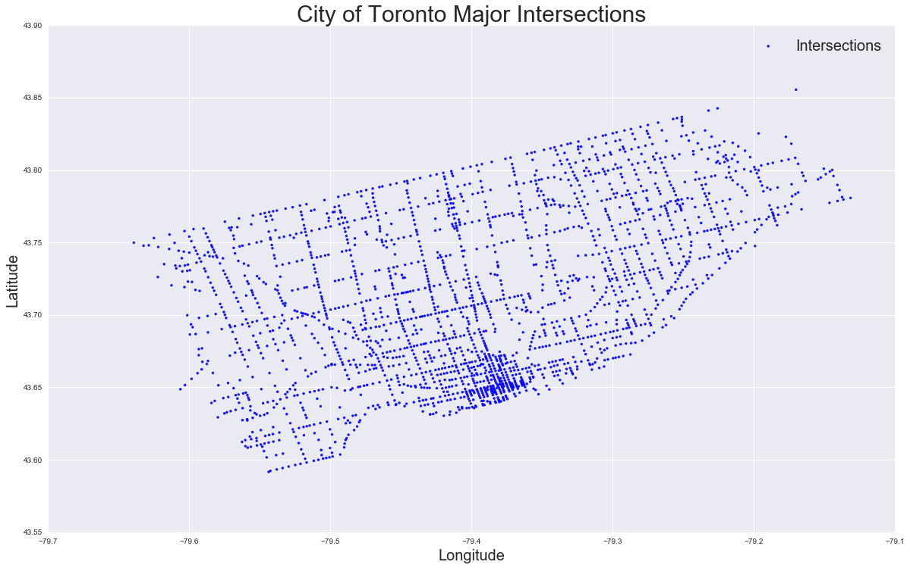
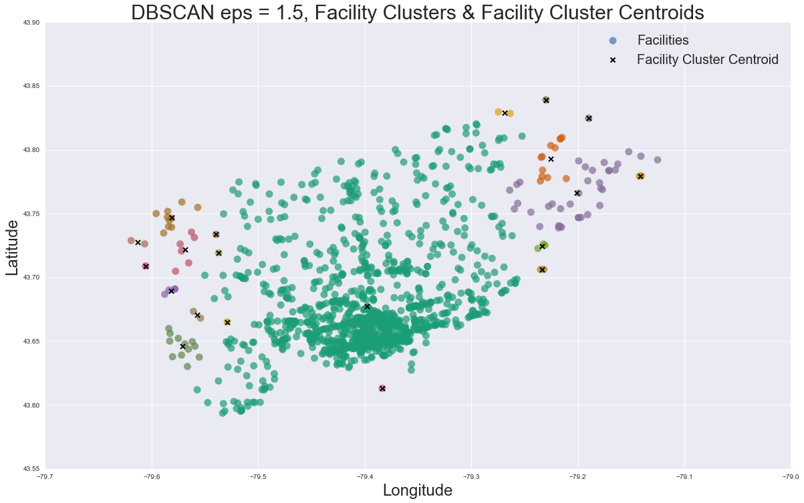
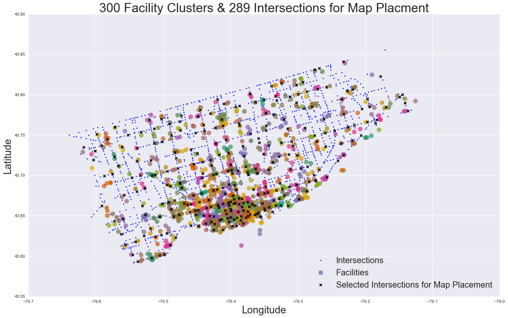

# Toronto Apache Spark [HackOn(Data)](http://hackondata.com/) Event 2016
**--1st Place Winner Solution - Map Placement for City of Toronto TO360 Wayfinding Project**

Qian(John) Xie, Roland Sing, and Mingfei Cao

**[HackOnData](http://hackondata.com/)** is a free two-day event that brings together the Toronto data community to take a closer look at the data that touches our daily lives. Teams of Toronto's top data scientists and data engineers collaborated to generate practical insights from data provided by local companies, not-for profits and the government. Prior to the event, weekly workshops and challenges will help prepare participants by giving them the knowledge and hands-on experience required to ensure they can meaningfully participate. During the event, well-known mentors from Toronto and around the world engaged with participants to take their knowledge and skill to the next level. HackOn(Data) is the best platform available to local data talent and businesses to meet, collaborate, and exchange knowledge, experience and job opportunities!

**Sponsers**  
TranQuant, flipp, wattpad, LoyaltyOne, amazon, Lightbend, GuruLink, Shopify

** Partners**  
Toronto Apache Spark, scalator, Deep Learning Toronto, HackerNest, HacherNest Toronto Tech Socials, TechToronto, DMZ, City of Toronto, Toronto Public Library

# 1 Project Overview

## 1.1 Background and Motivation

In 2011, City of Toronto launched the TO360 Wayfinding Project. The integrated multi-modal wayfinding strategy is comprised of pedestrian, vehicular, cyclying and transit wayfinding. The project is aimed to:
* Enhance the overall image of Tornto as a destination
* Increase visitors at key attractions, spending in the Greater Toronto Area, boost the local econnomy
* Increase confidence to walk, reduce walk times, promote multi-modal transit and reduce auto use
* Improve urban realm, sense of community, pedestrian safety, health and environment

The project is implemented in three phases:  
* Phase 1: Wayfinding strategies (2011 - 2012)
* Phase 2: Pilot implementation  (2014 - 2015)
* Phase 3: City-wide roll out   (2016 - 2017)

Right now, the project in in phase 3. In determining where wayfinding products are required, a number of factors were considered:

**Existing Need** - The implementation strategy prioritizes areas where a need for wayfinding currently exists based on:  
* having high densities of visitors who are unfamiliar with the city
* having high pedestrian volumnes
* having changes in mode of travel
* being on a main street
* being an area that is difficult to navigate
* being close to hospitals, colleges or universities
* being close to a city centre

** Available Funding** - Further, certain areas may be prioritized as project partners come forward with funding to implement the schem.  Potential project partners include:  
* transit agencies
* Business Improvment Areas
* universities and health care campuses
* attractions
* city divisions
* tourism organizations

## 1.2 Objectives
For the **HackOn(Data)** event, City of Toronto have an interest in exploring a more data-driven methodology to determine the timing and geographic distribution of the required TO360 map assest upgrades. The data-driven methodology may help gain valuable insights from a different and novel perspective and help domain experts to make more effective and reliable map placement plan.

**Reference**: [Toronto Wayfinding Strategy](http://www1.toronto.ca/wps/portal/contentonly?vgnextoid=8057524d63f02410VgnVCM10000071d60f89RCRD&vgnextchannel=d90d4074781e1410VgnVCM10000071d60f89RCRD)

## 1.3 Our Approach
We choose an expoloratory approach for this problem. We are not aiming to find a "perfect" solution by considering all needs and using all the available data. Instead, our goal is to build a prototype model using the a few of the most important data sources(provided by [TranQuant](http://tranquant.com/) and [City of Toronto Open Data](http://www1.toronto.ca/wps/portal/contentonly?vgnextoid=9e56e03bb8d1e310VgnVCM10000071d60f89RCRD)). If we can gain insights from the solution and the methodology is actionable, we can refine the prototype methodology by taking into consideration more needs, incooporating more data sources, and using more advanced algorithms.

Among the four aspects of the multi-modal wayfinding strategy, we focus on the **pedestrian wayfinding**. We chose to analyze two datasets from the City of Toronto, available on TranQuant:  
* Cultural Spaces: This dataset is a compilation of all spaces within the 44 City wards that were available for cultural use for a five year period.
* Signalized Intersection Traffic and Pedestrians: This dataset contains traffic and pedestrian volume data collected at intersections where there are traffic signals from 1999 to 2015.

# 2 Data
* Pedestrian and Vehicle Volume Data of Major Intersections
  - `ped_vol_2012.csv`: pedestrian and vehicle volume data collected at some intersections in 2012 
  - `ped_vol_2013.csv`: pedestrian and vehicle volume data collected at some intersections in 2013
  - `ped_vol_2014.csv`: pedestrian and vehicle volume data collected at some intersections in 2014
  - `ped_vol_2015.csv`: pedestrian and vehicle volume data collected at some intersections in 2015
  - `signalizedTrafficPedestrianVolumes` - pedestrian and vehicle volume data collected at some intersections from 1999 - 2012

* Cultural Facility Data  
  The same data was provided in three formats
  - `MSFC_44_Wards_Complete_Final.csv`: List of cultural facilities in Toronto. The file consists of the name of the facility, address, ward information, ownership of facilities that are available on a rental basis for cultural events. The two accompanying documents `MSFC_Readme_1.csv` and `MSFC_Readme_2.csv` give detailed describe the contents of the file and the schema(columns) of the file. The `MSFC_44_Wards_Complete_Final.csv` only provides postal code, no coordinates for facility. 
  
  - `Make_space_for_culture_mtm3.zip`:  with shape files of MTM 3 coordinate system and facility file `MAKE_SPACE_FOR_CULTURE.dbf`, which contains coordinates for facilities. 
  - `Make_space_for_culture_wgs84.zip`: with shape files for WGS84 coordinate system and facility file `MAKE_SPACE_FOR_CULTURE_WGS84.dbf`, which contains coordinates for facilities.
  

# 3 Exploratory Data Analysis

#### Intersections

#### Cultural Facilities

## 3.1 DBSCAN Clustering

## 3.2 KMeans Clustering

# 4 Selected Intersections for Map Placement

## 4.1 Only Consider Distance

## 4.2 Consider Distance and Pedestrian Volume

# 5 Future Improvement
There is a lot we can do to improve our current soltuion. 
1. Explore other methodologies. Clustering is only one of the possible methodolgies that may lead to a solution. We can also try other methodologies and compare the results. Formulating the problem as an optimization problem is a worth trying direction. Or we can combine clustering and optimization by applying optimization to each clusters.
2. Using more point of interest data. In our current study, we only used 1397 cultural facilities for building our solution. There is a lot more point of interest(such as hospitals, colleges or universities, attractions, commerical areas, etc.) we need to incorporate to make the study representative.
3. Consider more needs when choose an intersection for map placment. In our current study, we considered distance and pedestrian volume. Other needs we should consider include:
  * having high densities of visitors who are unfamiliar with the City
  * having changes in mode of travel
  * being on a main street
  * being in an area that is difficult to navigate
  * being close to hospitals, colleges or universities
  * being close to a city centre  
4. Insights from domain experts. City planners have more practical insights on whether an intersection is appropriate for map placement. We can improve our solution by taking advices from domain experts.

