# Toronto Apache Spark [HackOn(Data)](http://hackondata.com/) Event 2016
**--1st Place Winner Solution - Map Placement for City of Toronto TO360 Wayfinding Project**

Qian(John) Xie, Mingfei Cao, and Roland Sing

**[HackOnData](http://hackondata.com/)** is a free two-day event that brings together the Toronto data community to take a closer look at the data that touches our daily lives. Teams of Toronto's passionate data scientists and data engineers collaborated to generate practical insights from data provided by local companies, not-for profits and the government. Prior to the event, eight weekly workshops and challenges helped prepare participants by giving them the knowledge and hands-on experience required to ensure they can meaningfully participate. During the event, well-known mentors from Toronto and around the world engaged with participants to take their knowledge and skill to the next level. HackOn(Data) is the best platform available to local data talent and businesses to meet, collaborate, and exchange knowledge and experience!

**Sponsers**  
TranQuant, flipp, wattpad, LoyaltyOne, amazon, Lightbend, GuruLink, Shopify

**Partners**  
Toronto Apache Spark, scalator, Deep Learning Toronto, HackerNest, HacherNest Toronto Tech Socials, TechToronto, DMZ, City of Toronto, Toronto Public Library

# 0 Solution Notebooks

The solution is implemented in both Python and Spark (PySpark API). The solution notebooks are publicly availabel on my Github repository and on Databricks.

* Python Solution
  - [Python solution notebook on my Github](https://github.com/XIEQ/hackondata/blob/master/Map_Placement_City_of_Toronto.ipynb)
  - <a href="http://nbviewer.jupyter.org/github/XIEQ/hackondata/blob/master/Map_Placement_City_of_Toronto.ipynb"> Or you can view complete solution notebook through nbviewer</a>
  
* Spark solution was done using Databricks Community Edition, and the Databricks notebooks are available here:
  - [Databricks Notebook 0: Project Overview](https://databricks-prod-cloudfront.cloud.databricks.com/public/4027ec902e239c93eaaa8714f173bcfc/8891646194974755/2498144867240658/6439822263820045/latest.html)
  - [Databricks Notebook 1: Data Preparation](https://databricks-prod-cloudfront.cloud.databricks.com/public/4027ec902e239c93eaaa8714f173bcfc/8891646194974755/2498144867240604/6439822263820045/latest.html)
  - [Databricks Notebook 2: Exploratory Analysis](https://databricks-prod-cloudfront.cloud.databricks.com/public/4027ec902e239c93eaaa8714f173bcfc/8891646194974755/2498144867240997/6439822263820045/latest.html)
  - [Databricks Notebook 3: DBSCAN Clustering](https://databricks-prod-cloudfront.cloud.databricks.com/public/4027ec902e239c93eaaa8714f173bcfc/8891646194974755/2498144867240775/6439822263820045/latest.html)
  - [Databricks Notebook 4: KMeans Clustering](https://databricks-prod-cloudfront.cloud.databricks.com/public/4027ec902e239c93eaaa8714f173bcfc/8891646194974755/2498144867240858/6439822263820045/latest.html)
  - [Databricks Notebook 5: Map Placement Based on Clustering](https://databricks-prod-cloudfront.cloud.databricks.com/public/4027ec902e239c93eaaa8714f173bcfc/8891646194974755/2498144867240666/6439822263820045/latest.html)

# 1 Project Overview
## 1.1 Background and Motivation

In 2011, City of Toronto launched the TO360 Wayfinding Project. The integrated multi-modal wayfinding strategy is comprised of pedestrian, vehicular, cycling and transit wayfinding. The project is aimed to:
* Enhance the overall image of Toronto as a destination
* Increase visitors at key attractions, spending in the Greater Toronto Area, boost the local economy
* Increase confidence to walk, reduce walk times, promote multi-modal transit and reduce auto use
* Improve urban realm, sense of community, pedestrian safety, health and environment

The project is implemented in three phases:  
* Phase 1: Wayfinding strategies (2011 - 2012)
* Phase 2: Pilot implementation (2014 - 2015)
* Phase 3: City-wide roll out   (2016 - 2017)

Right now, the project in in phase 3. In determining where wayfinding products are required, a number of factors were considered:

**Existing Need** - The implementation strategy prioritizes areas where a need for wayfinding currently exists based on:  
* having high densities of visitors who are unfamiliar with the city
* having high pedestrian volumes
* having changes in mode of travel
* being on a main street
* being an area that is difficult to navigate
* being close to hospitals, colleges or universities
* being close to a city centre

** Available Funding** - Further, certain areas may be prioritized as project partners come forward with funding to implement the scheme.  Potential project partners include:  
* transit agencies
* Business Improvement Areas
* universities and health care campuses
* attractions
* city divisions
* tourism organizations

## 1.2 Objectives
For the **HackOn(Data)** event, City of Toronto have an interest in exploring a more data-driven methodology to determine the timing and geographic distribution of the required TO360 map assest upgrades. The data-driven methodology may help gain valuable insights from a different and novel perspective and help domain experts to make more effective and reliable map placement plan.

**Reference**: [Toronto Wayfinding Strategy](http://www1.toronto.ca/wps/portal/contentonly?vgnextoid=8057524d63f02410VgnVCM10000071d60f89RCRD&vgnextchannel=d90d4074781e1410VgnVCM10000071d60f89RCRD)

## 1.3 Our Approach
We choose an exploratory approach for this problem. We are not aiming to find a "perfect" solution by considering all needs and using all the available data. Instead, our goal is to build a prototype model using the a few of the most important data sources (provided by [TranQuant](http://tranquant.com/) and [City of Toronto Open Data](http://www1.toronto.ca/wps/portal/contentonly?vgnextoid=9e56e03bb8d1e310VgnVCM10000071d60f89RCRD)). If we can gain insights from the solution and the methodology is actionable, we can refine the prototype methodology by taking into consideration more needs, incorporating more data sources, and using more advanced algorithms.

Among the four aspects of the multi-modal wayfinding strategy, we focus on the **pedestrian wayfinding**. We chose to analyze two datasets from the City of Toronto, available on TranQuant:  
* Cultural Spaces: This dataset is a compilation of all spaces within the 44 City wards that were available for cultural use for a five year period.
* Signalized Intersection Traffic and Pedestrians: This dataset contains traffic and pedestrian volume data collected at intersections where there are traffic signals from 1999 to 2015.

## 1.4 Overview of Solution Process
Aftering deciding to use the above two datasets, the study began with a single question: what criteria should we consider when choosing an intersection to place map?

In the begining, we considered the problem as an optimization problem. After some discussion, we decided this direction is possible but might be difficult to implement in a two-day time limite. Then we did some exploratory data analysis by plotting the intersections and facilities geographic distribution on map. After seeing the plot, we thought clustering is a direction we should try. The logic is as follows: 

1. Clustering the facilites into groups according to their geographic distribution
2. Find the geographic coordinates of each facility cluster centroid
3. Select the closest three intersections to a facility cluster centroid
4. Among the closest three intersections, choose the intersection with the highest pedestrian volume

The logic is heuristic but simple and easy to implement, so we managed to build a solution based on this logic within the two day time limit. 

I tried two clustering algorithms: DBSCAN and KMeans. DBSCAN is density-based clustering while KMeans is centroid-based clustering

At this stage, I adopted KMeans algorithm. KMeans works better to spatially evenly divide our facilities into clusters according to their geographic coordinates. DBSCAN can provide another perspective of looking at the problem and we can explore that angle in the future.

# 2 Data
* Pedestrian and Vehicle Volume Data of Major Intersections
  - `ped_vol_2012.csv`: pedestrian and vehicle volume data collected at some intersections in 2012 
  - `ped_vol_2013.csv`: pedestrian and vehicle volume data collected at some intersections in 2013
  - `ped_vol_2014.csv`: pedestrian and vehicle volume data collected at some intersections in 2014
  - `ped_vol_2015.csv`: pedestrian and vehicle volume data collected at some intersections in 2015
  - `signalizedTrafficPedestrianVolumes` - pedestrian and vehicle volume data collected at some intersections from 1999 - 2012

* Cultural Facility Data  
  The same data was provided in three formats
  - `MSFC_44_Wards_Complete_Final.csv`: List of cultural facilities in Toronto. The file consists of the name of the facility, address, ward information, ownership of facilities that are available on a rental basis for cultural events. The two accompanying documents `MSFC_Readme_1.csv` and `MSFC_Readme_2.csv` give detailed describe the contents of the file and the schema(columns) of the file. The `MSFC_44_Wards_Complete_Final.csv` only provides postal code, no coordinates for facility. 
  
  - `Make_space_for_culture_mtm3.zip`:  with shape files of MTM 3 coordinate system and facility file `MAKE_SPACE_FOR_CULTURE.dbf`, which contains coordinates for facilities. 
  - `Make_space_for_culture_wgs84.zip`: with shape files for WGS84 coordinate system and facility file `MAKE_SPACE_FOR_CULTURE_WGS84.dbf`, which contains coordinates for facilities.
  

# 3 Exploratory Data Analysis

## 3.1 Pedestrian and Vehicle Volume Distribution
In this section, we will check intersection pedestrian and vehicle volume distribution to see what pattern they follows or to see whether there is any `interesting` behavior in the data.

#### Pedestrian Volume Distribution
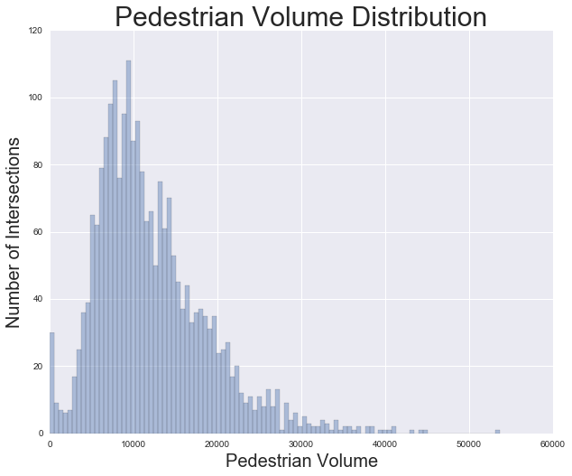

#### Vehicle Volume Distribution
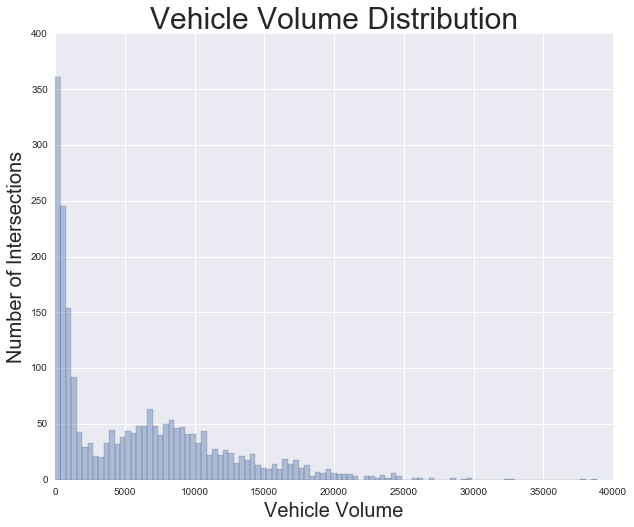

#### Intersections

From the graph, we can see the shap of the City of Toronto and main street and how the intersections are disbributed geographically.

#### Cultural Facilities
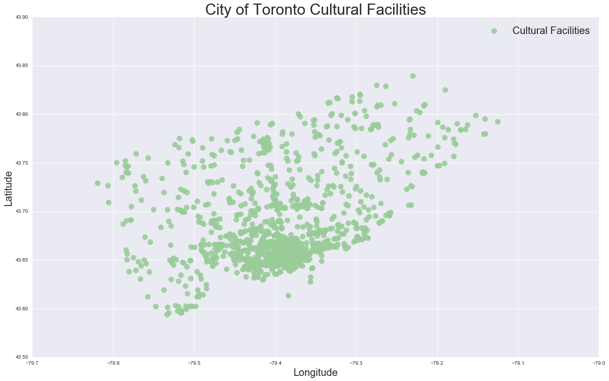

This graphs show us the geographic distribution of cultural facilities according to their coordinates. It is no surprise that cultural facilities are condensed in downtown arear of the City of Toronto.

## 3.2 DBSCAN Clustering
We first tried [DBSCAN](http://scikit-learn.org/stable/modules/clustering.html#dbscan) algorithm in `scikit-learn` for clustering. DBSCAN is base on the paper:

* “A Density-Based Algorithm for Discovering Clusters in Large Spatial Databases with Noise” Ester, M., H. P. Kriegel, J. Sander, and X. Xu, In Proceedings of the 2nd International Conference on Knowledge Discovery and Data Mining, Portland, OR, AAAI Press, pp. 226–231. 1996

This algorithm is aimed for spatial data, which might be a good fit for our case.

The following is a description of DBSCAN algorithm from sklearn:

>The DBSCAN algorithm views clusters as areas of high density separated by areas of low density. Due to this rather generic view, clusters found by DBSCAN can be any shape, as opposed to k-means which assumes that clusters are convex shaped. The central component to the DBSCAN is the concept of core samples, which are samples that are in areas of high density. A cluster is therefore a set of core samples, each close to each other (measured by some distance measure) and a set of non-core samples that are close to a core sample (but are not themselves core samples). There are two parameters to the algorithm, `min_samples` and `eps`, which define formally what we mean when we say dense. Higher `min_samples` or lower `eps` indicate higher density necessary to form a cluster.

DBSCAN algorithm clusters dataset based on two parameters:

 * **eps** - The max distance between neighbour points to be considerted in a cluster

 *  **min_samples** - the minimum cluster size. If it is set to 1, it means every data point will be assigned to either a cluster or form its own cluster of 1 data point. If `min_sample` is set to be larger than one, then cluster with size less than min_sample will be considered as noise.

The scikit-learn DBSCAN haversine distance metric requires data in the form of [latitude, longitude] and both inputs and outputs are in units of radians.

#### Choose Parameters for DBSCAN clustering algorithm
Since in our facility dataset, we need to consider all facilities, we don't want any of them to be classified as noise, so we set `min_samples`=1. Now our clustering will depend on a proper `eps` value.

Let's try esp = 1.5, 1.0, 0.7 (km)

Note that `eps` need to be converted to radians for use by harversine

### 3.2.1 DBSCAN Clustering with eps = 1.5 km

As we can see when we set eps = 1.5, the DBSCAN algorithm groups the cultural facilities into 20 clusters based on their geographic coordinates. The figure further proved the concept that:
> "DBSCAN algorithm views clusters as areas of high density separated by areas of low density. Due to this rather generic view, clusters found by DBSCAN can be any shape, as opposed to k-means which assumes that clusters are convex shaped."

Obviously, 20 cluster is not enough. We need a lot more than 20 intersections to place map. Let's adjust the `eps` parameter and see what result we can get.

### 3.2.2 DBSCAN Clustering with eps = 0.7 km

When we set eps = 0.7, the DBSCAN algorithm groups the facilities into 185 clusters. From the plot we can clearly see that the core of downtown is a huge cluster, accounting for more than half of all facilities, while most other cluster only has one facility. This is not a resonable clustering that we can base on to put maps. Let's try eps = 1.0 km and see if we can get a reasonable result.

### 3.2.3 DBSCAN Clustering with eps = 1.0 km

With eps = 1.0 km, the DBSCAN algorithm groups the facilities into 93 clusters. Again, downtown and middle down facilites are in the same huge cluster, and other facilities are rather nicely grouped. Based on these findings we learned that DBSCAN alone is not good enough for our needs, but it can be used to select the areas where facilities are dense and help implement a phase-wise plan for rolling out maps throughout the City of Toronto.

## 3.3 DBSCAN for Phase-wise Implementation
The citywide roll-out of the map placement will be implemented through a 3-year plan as shown in the following map. 

* Year 1: Complete TO360 roll-out within Core of Downtown Toronto
* Year 2: Focused roll-out of TO360 map in and around main streets, BIAs and transit hubs
* Year 3: Citywide roll-out of TO360 map

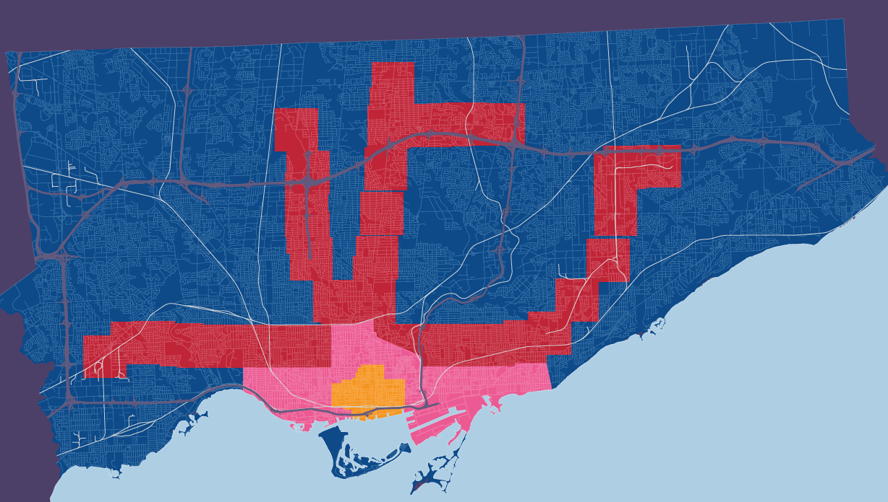

DBSCAN algorithm can help to select the facilities for each phase of implementation.

### 3.3.1 Downtown and Mainstreet Facilities
Downtown cluster is very condensed, it includes 1064 facilities out of the total 1397 facilities. Let's extract Downtown facilities basen on previous DBSCAN clustering(eps = 1.0 km)

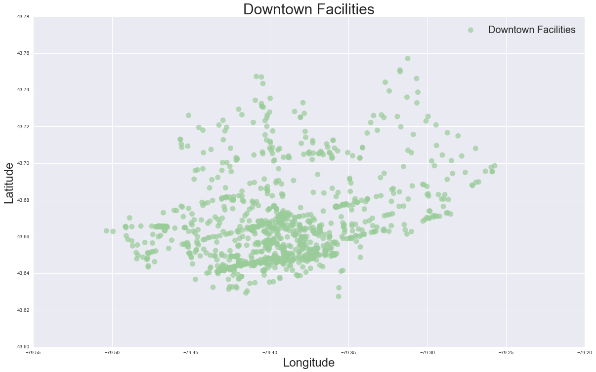

### 3.3.2 Downtown Facilities Clustering
Set eps = 0.4 km to further clustering downtown facilities, and then extract core downtown facilities based on DBSCAN clustering result.
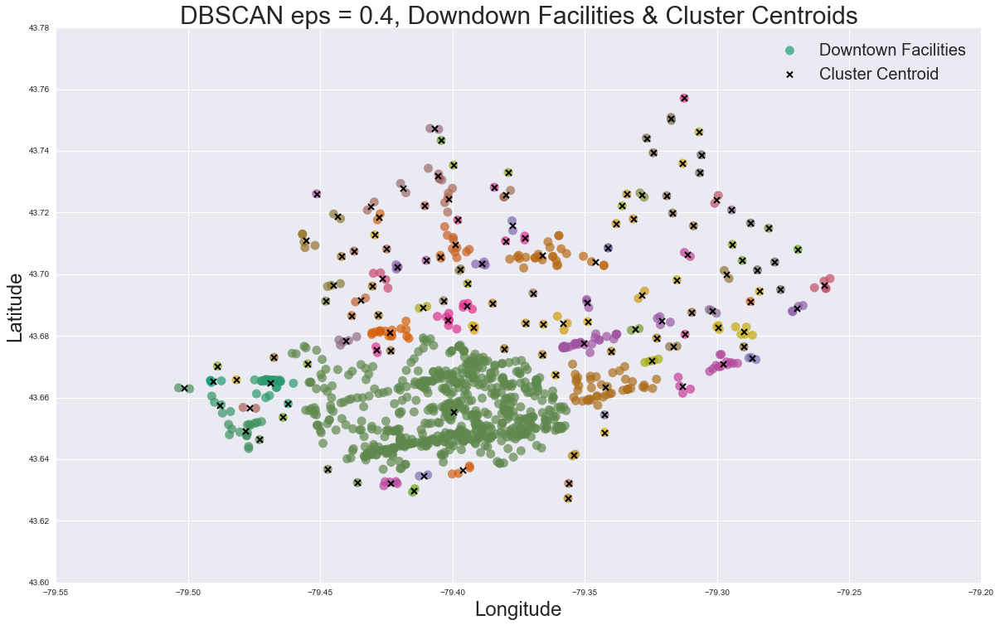

### 3.3.3 Extract Core Downtown Facilities
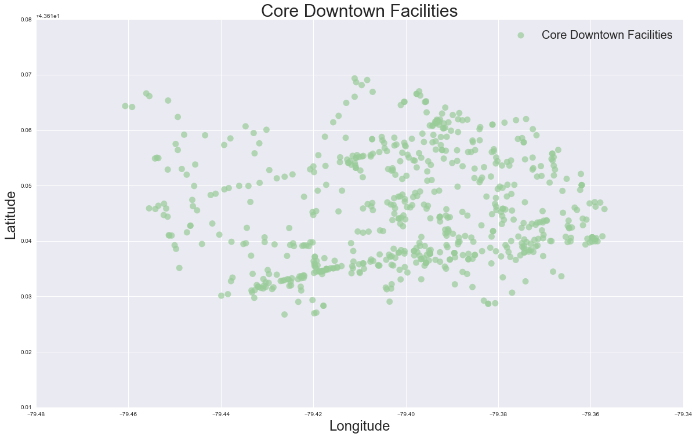

There are 655 facilities in the core of downtown Toronto

Now, we have three groups of facilities: core downtown facilities, downtown and main streets facilities, and out of core facilities. With these three groups of facilities, we can implement the 3 year phase-wise plan for map roll-out. For each group of facilites we can then use KMeans clustering algorithm to further clustering them into small groups and then we can put a map near the centroid of each cluster of facilities.

**Note**  
In current solution, we did not applied KMeans clustering to each of the three groups. Instead, we applied KMeans to the entire facility dataset to make a quick prototype. In future improvement, we can apply KMeans clustering to each of the three groups of facilities.

## 3.4 KMeans Clustering
In this section, we use KMeans clustering algorithm to group cultural facilities according to their geographic coordinates.

**Note**  
Here we apply KMeans clustering to the entire facility dataset to get a general idea of how KMeans algorithm works for our problem.

### 3.4.1 KMeans Clustering with 200 Clusters
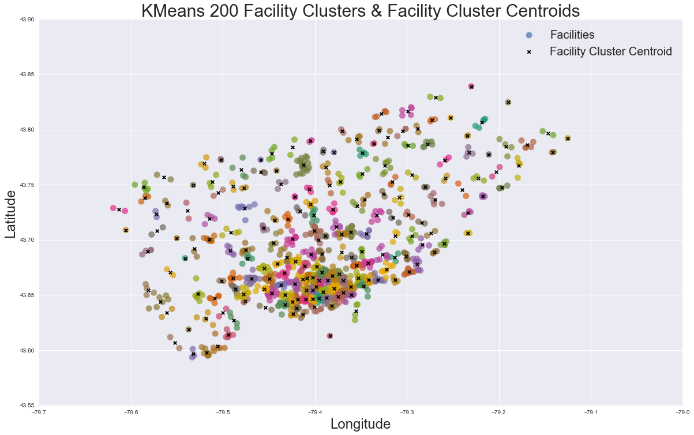
From the above plot we can see that 200 clusters might not be enough because the distance a map needs to cover is too long.

### 3.4.2 KMeans Clustering with 300 Clusters
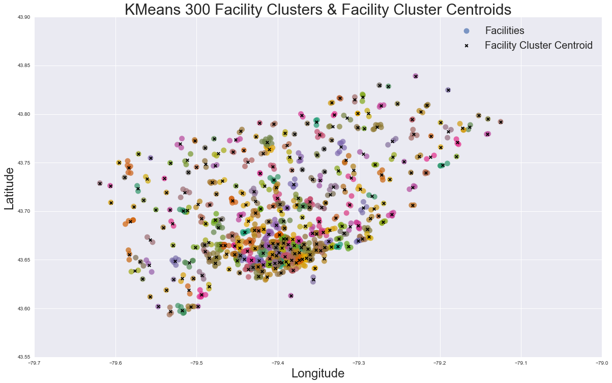
We will use 300 clusters as the prototype for later selection of intersections for map placement.

The following is plot of intersections and the 300 facility cluster centroids.The small blue dots represent intersections, the big black dots represent facility cluster centroids. Our goal now is to find the closet intersection for each cluster centroid. We are going to find a proper intersection for each of the centroid to place map.
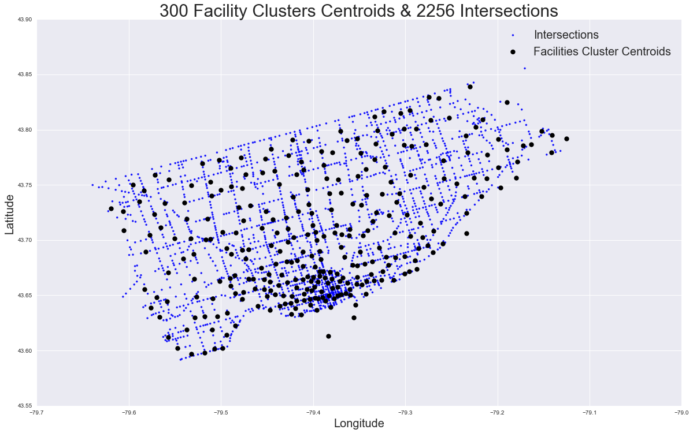

# 4 Selected Intersections for Map Placement
Now we have 300 facilities clusters and their centroids, our goal is to find an appropriate intersection to place map for each facility cluster as shown in the following plot. 

We compared two cases:  
**Case 1**: Select the intersection that is closest to the centroid of a cluster  
**Case 2**: Select the three closest intersections to  the centroid of a cluster, then among the three the closest intersections, we select the one with the highest pedestrian volume.

**KDTree Algorithm**   
To find the closest intersection to a cluster centroid, we will use KDTree algorithm.

## 4.1 Case1: Only Consider Distance
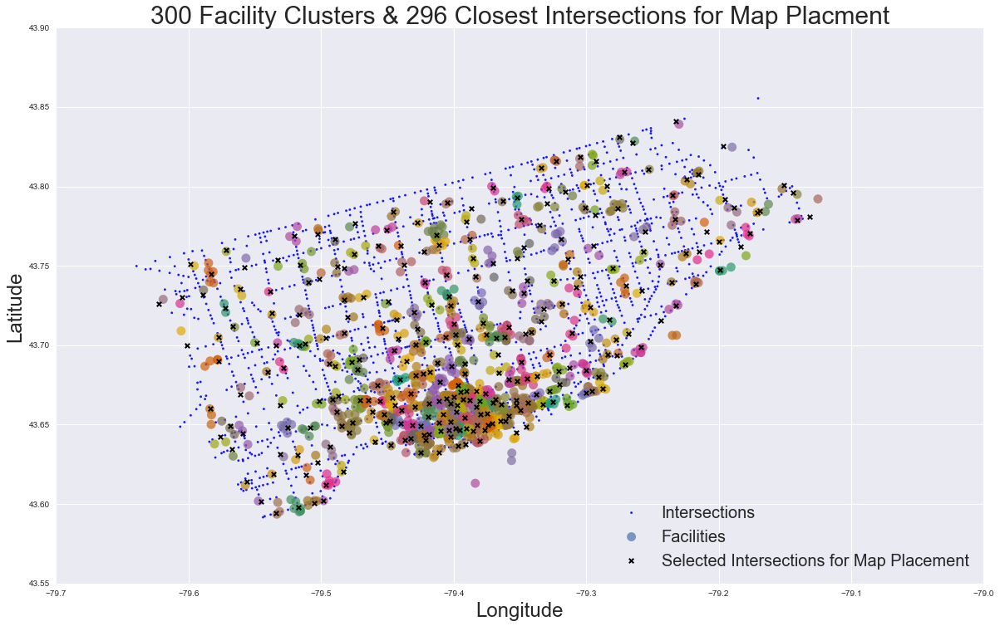

If we only consider distance, the average 8 hour pedestrian volume is 11246.8 for the select 296 intersections

## 4.2 Case 2: Consider Both Distance and Pedestrian Volume

If we consider both distance and pedestrian volume, the average 8 hour pedestrian volume is 16004.4 for the selected 286 intersections. In other words intersections selected by this method has in average 4758 more pedestrian volume or 42% pedestrian volume in 8 Hour period compare to the intersection selected only considering distance. This is a huge difference. Therefore, we will select intersections using the second method, which considers both distance and pedestrian volume.

# 5 Future Improvement
There is a lot we can do to improve our current solution.

1. Explore other methodologies. Clustering is only one of the possible methodologies that may lead to a solution. We can also try other methodologies and compare the results. Formulating the problem as an optimization problem is a worth trying direction. Or we can combine clustering and optimization by applying optimization to each clusters.

2. Using more point of interest data. In our current study, we only used 1397 cultural facilities for building our solution. There is a lot more point of interest (such as hospitals, colleges or universities, attractions, commercial areas, etc.) we need to incorporate to make the study more representative.

3. Consider more needs when choose an intersection for map placement. In our current study, we considered distance and pedestrian volume. Other needs we should consider include:
  * having high densities of visitors who are unfamiliar with the City
  * having changes in mode of travel
  * being on a main street
  * being in an area that is difficult to navigate
  * being close to hospitals, colleges or universities
  * being close to a city center  
  
4. Insights from domain experts. City planners have more practical insights on whether an intersection is appropriate for map placement. We can improve our solution by taking advices from domain experts.

